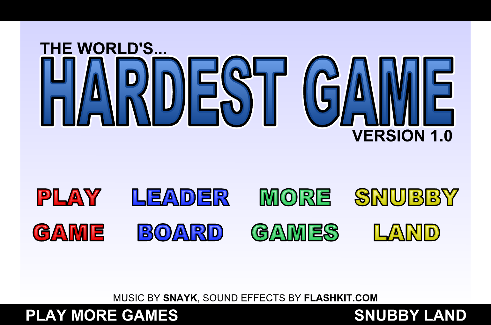
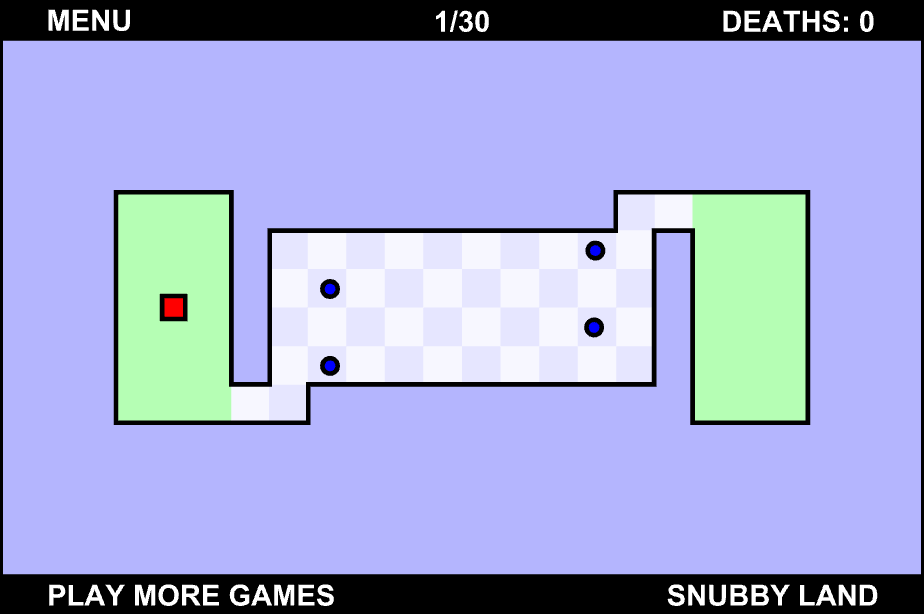

# World's Hardest Game (Python / Pygame)

Este projeto é uma **réplica em Python do clássico jogo da web _World's Hardest Game_**, desenvolvida utilizando a biblioteca **Pygame**.

O objetivo é recriar a jogabilidade desafiadora do jogo original, com movimentação precisa, padrões de inimigos bem definidos e foco em habilidade e tempo de reação do jogador.

> ⚠️ Este projeto tem fins educacionais e de aprendizado em desenvolvimento de jogos com Python.

---

<p align="center">
  
  
</p>

## 🎮 Sobre o jogo

No jogo, o jogador deve:
- Controlar um personagem simples
- Desviar de inimigos em movimento
- Atravessar fases cada vez mais difíceis
- Chegar ao objetivo sem colidir com obstáculos

A dificuldade é propositalmente alta, seguindo o espírito do jogo original.

---

## 🛠️ Tecnologias utilizadas

- **Python 3**
- **Pygame**

---

## 📦 Requisitos

Todas as dependências do projeto estão listadas no arquivo:

```
requirements.txt
```

---

## ▶️ Como rodar o projeto

Siga os passos abaixo para executar o jogo localmente:

### 1️⃣ Clone o repositório

```bash
git clone <url-do-repositorio>
cd <nome-do-projeto>
```

### 2️⃣ Instale as dependências

```bash
pip install -r requirements.txt
```

### 3️⃣ Execute o jogo

```bash
python main.py
```

---

## 📁 Estrutura do projeto (resumo)

```
├── main.py            # Arquivo principal do jogo
├── requirements.txt   # Dependências do projeto
├── player.py          # Lógica do jogador
├── enemy.py           # Lógica base de inimigos
├── level.py           # Lógica base das fases
├── checkpoint.py      # Lógica de checkpoint
├── coin.py            # Lógica das moedas para coletar 
├── sound.py           # Lógica dos efeitos sonoros e música
├── settings.py        # Configurações globais
├── levels/            # Definição das fases
├── enemies/           # Definição dos vários tipos de inimigos
├── sounds/            # Contém todos os sons utilizados no jogo
└── images/            # Prints para o README
```

---

## 🚀 Planos futuros

O projeto está em desenvolvimento ativo e possui vários planos de expansão, incluindo:

- 🎬 **Tela de início (menu principal)**
- 🧭 **HUD (interface do jogador)**
  - Tempo
  - Mortes
  - Progresso
- 🛠️ **Editor de fases**
  - Cada jogador poderá criar seus próprios níveis
- 🌍 **Leaderboard global**
  - Comparação dos melhores jogadores do mundo
  - Ranking por tempo e desempenho

---

## 📚 Objetivos do projeto

- Aprimorar conhecimentos em **Python e Pygame**
- Praticar **arquitetura de jogos 2D**
- Trabalhar com **movimentação precisa, colisões e lógica de estados**
- Evoluir o projeto para algo extensível e reutilizável

---

## 📄 Licença

Este projeto é apenas para fins educacionais. O jogo original _World's Hardest Game_ pertence aos seus respectivos autores.

---

Se quiser contribuir, testar ou sugerir melhorias, fique à vontade! 🚀

